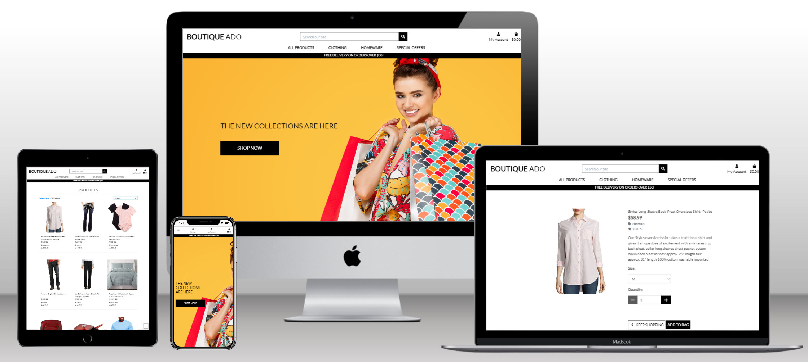

<h1 align="center">Boutique Ado</h1>

## This a  walkthrough project from Code Institute.

GitHub repository can be found 
<a href="https://github.com/petrugio/boutique_ado_v1" target="_blank" rel="noopener">here</a>

Live project is deployed on Heroku
<a href="https://boutique-ado-proj.herokuapp.com/" target="_blank" rel="noopener">here</a>

# Technologies used
- [HTML5](https://en.wikipedia.org/wiki/HTML5) for the contents and structure of the website.
- [CSS3](https://en.wikipedia.org/wiki/CSS) for the styling and animations.
- [JS](https://developer.mozilla.org/en-US/docs/Web/JavaScript) timed message functions.
- [AWS](https://aws.amazon.com/) for static files and media.
- [elephantsql](elephantsql.com) postgres database.
- [Stripe](https://stripe.com) for payment.
- [GitHub](https://github.com/) as a remote repository.
- [gitpod.io](https://www.gitpod.io) was used as IDE and  git version control.
- [Heroku](https://www.heroku.com/) to deploy the website/app.
- [Chrome](https://www.google.com/intl/en_ie/chrome/),  [Firefox](https://www.mozilla.org/en-US/firefox/new/),
[Brave Browser](https://brave.com/),
[Edge](https://www.microsoft.com/en-us/edge) and [Opera](https://www.opera.com/) for browser testing the responsiveness.
- [Chrome Developer Tools](https://developer.chrome.com/docs/devtools/) for testing screen sizes and using - [Lighthouse](https://developers.google.com/web/tools/lighthouse).
- [https://looka.com](https://looka.com) to create logo.
- [Favicon.io](https://favicon.io/favicon-generator/) to create a favicon.
- [Multi Device Website Mockup Generator](https://techsini.com/multi-mockup/index.php) for testing and to make responsive image.
- [Django Secret Key Generator](https://djecrety.ir/) for generating secure Django keys
- [Bootstrap 4](https://getbootstrap.com/docs/4.0/getting-started/introduction/) for responsive design

## Frameworks
[Django 3.2](https://docs.djangoproject.com/en/3.2/contents/) 

# Contact

My name is [Petru Chelban](https://github.com/petrugio) I am a full-stack software developer student at [Code Institute](https://codeinstitute.net/ie/), where I am pursuing Diploma in Full Stack Software Development.

Please do not hesitate to contact me if you require any additional information about this project or wish to discuss work/collaboration opportunities.

- [LinkedIn](https://www.linkedin.com/in/petruchelban/)
- [GitHub](https://github.com/petrugio)

